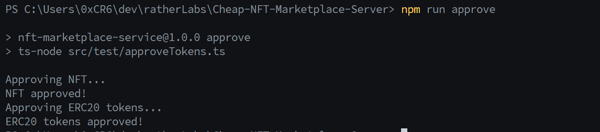
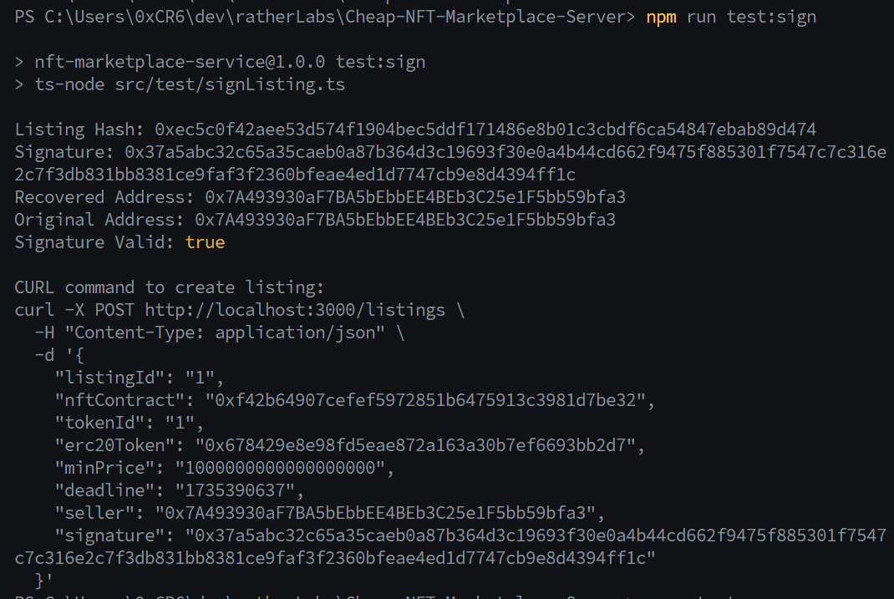
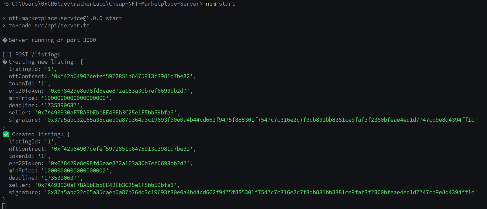
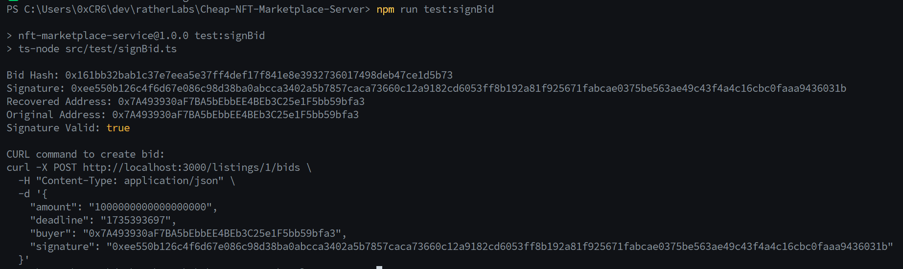
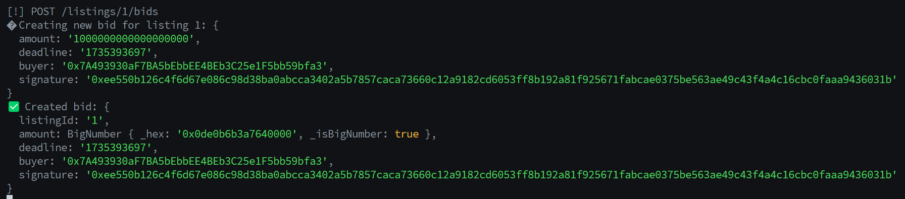
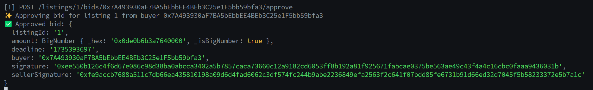
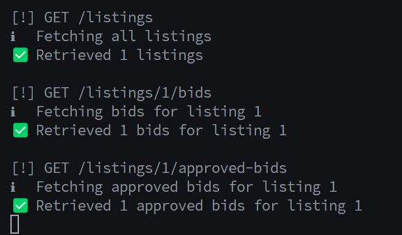
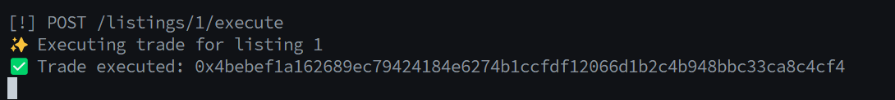

# Cheap-NFT-Marketplace-Server

A lightweight microservice for handling off-chain NFT marketplace operations on Arbitrum Sepolia. Enables gasless listings and bids with signature-based trading, where users only pay gas when executing the final trade.

## Table of Contents

- [Features](#features)
- [Quick Start](#quick-start)
- [Complete Trading Flow](#complete-trading-flow)
  - [1. Setup](#1-setup)
  - [2. Create Listing](#2-create-listing)
  - [3. Create Bid](#3-create-bid)
  - [4. Execute Trade](#4-execute-trade)
- [Proof of Concept (POC)](#proof-of-concept-poc)
  - [1. Setup](#1-setup)
  - [2. Create Listing](#2-create-listing)
  - [3. Create Bid](#3-create-bid)
  - [4. Execute Trade](#4-execute-trade)
- [API Examples](#api-examples)

## Features

- ✨ Gasless listings and bids (pay gas only when trading)
- 🔒 Non-custodial - assets stay in users' wallets
- ⚡ Single-transaction settlement
- 🤝 Trustless trading with signature verification
- 📝 Support for any ERC721 and ERC20 tokens
- 💾 In-memory storage (no database required)

## Quick Start

```bash
# Install dependencies
npm install

# Start development server with hot reload
npm run dev

# Start production server
npm start
```

## Proof of Concept (POC)

### 1. Setup

Before trading, you need to:

1. Have NFTs and ERC20 tokens _(Minting is open for anyone)_

   Example transactions on Arbitrum Sepolia:

   - **Mint ERC20 (Amount: 1.000):** https://sepolia.arbiscan.io/tx/0x9294a0404fefde356cdc6d097e317b8c2656ed6be8b12fc6c7ba77095624a536
   - **Mint ERC721 (NFT ID: 1):** https://sepolia.arbiscan.io/tx/0x2aa720497b70b1dd83d84f85c0b2a9aa23724695e8f8c5407a971f0f2dec2088

2. Approve tokens for trading
   ```bash
   # Run the approval script
   npm run approve
   ```
   This will:
   - Approve NFT for marketplace contract
   - Approve ERC20 tokens for marketplace contract
     

### 2. Create Listing

1. Generate seller's signature

   ```bash
   npm run test:signListing
   ```

   

2. Submit listing to server
   ```bash
   curl -X POST http://localhost:3000/listings \
     -H "Content-Type: application/json" \
     -d '{
       "listingId": "1",
       "nftContract": "0xf42b64907cefef5972851b6475913c3981d7be32",
       "tokenId": "1",
       "erc20Token": "0x678429e8e98fd5eae872a163a30b7ef6693bb2d7",
       "minPrice": "1000000000000000000",
       "deadline": "1735390637",
       "seller": "0x7A493930aF7BA5bEbbEE4BEb3C25e1F5bb59bfa3",
       "signature": "0x37a5abc32c65a35caeb0a87b364d3c19693f30e0a4b44cd662f9475f885301f7547c7c316e2c7f3db831bb8381ce9faf3f2360bfeae4ed1d7747cb9e8d4394ff1c"
     }'
   ```
   

### 3. Create Bid

1. Generate buyer's signature

   ```bash
   npm run test:signBid
   ```

   

2. Submit bid to server

   ```bash
   curl -X POST http://localhost:3000/listings/1/bids \
     -H "Content-Type: application/json" \
     -d '{
       "amount": "1000000000000000000",
       "deadline": "1735393697",
       "buyer": "0x7A493930aF7BA5bEbbEE4BEb3C25e1F5bb59bfa3",
       "signature": "0xee550b126c4f6d67e086c98d38ba0abcca3402a5b7857caca73660c12a9182cd6053ff8b192a81f925671fabcae0375be563ae49c43f4a4c16cbc0faaa9436031b"
     }'
   ```

   

3. Seller approves bid
   ```bash
   curl -X POST http://localhost:3000/listings/1/bids/0x7A493930aF7BA5bEbbEE4BEb3C25e1F5bb59bfa3/approve \
     -H "Content-Type: application/json" \
     -d '{
       "sellerSignature": "0xfe9accb7688a511c7db66ea435810198a09d6d4fad6062c3df574fc244b9abe2236849efa2563f2c641f07bdd85fe6731b91d66ed32d7045f5b58233372e5b7a1c"
     }'
   ```
   

### 4. Execute Trade

1. Verify state (optional)

   ```bash
   # View all listings and bids
   curl http://localhost:3000/listings
   curl http://localhost:3000/listings/1/bids
   ```

   

2. Execute the trade
   ```bash
   curl -X POST http://localhost:3000/listings/1/execute
   ```
   
   Transaction: https://sepolia.arbiscan.io/tx/0x4bebef1a162689ec79424184e6274b1ccfdf12066d1b2c4b948bbc33ca8c4cf4

## API Examples

For a complete list of API examples and CURL commands, see [CURL_EXAMPLES.md](CURL_EXAMPLES.md).

These examples include:

- Creating listings
- Making bids
- Approving bids
- Executing trades
- Viewing listings and bids

All examples use real transactions and signatures from the Arbitrum Sepolia testnet.
